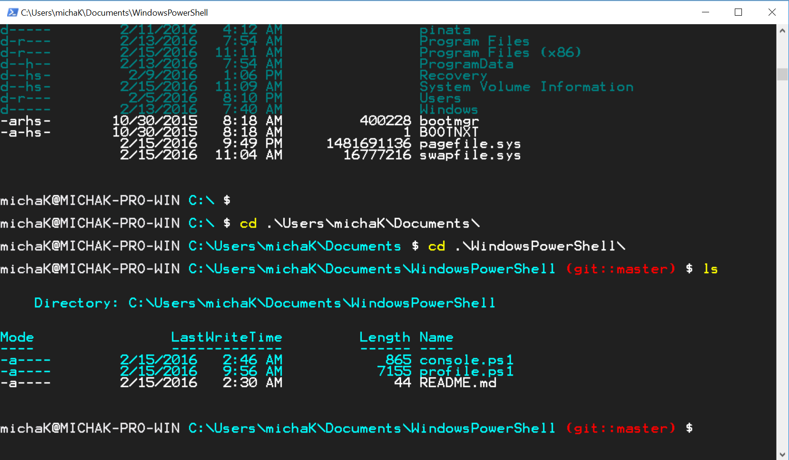

# WindowsPowerShell
A decent bash / git prompt for powershell 


## Requirements

You need to be able to execute powershell scripts on your computer.

This is disabled by default. To enable it, open a PowerShell prompt and type:

```posh
Set-ExecutionPolicy -ExecutionPolicy Unrestricted -Scope CurrentUser -Force
```

## Installation

```bash
cd %USERPROFILE%\Documents
git clone https://github.com/michaKFromParis/WindowsPowerShell
```
open a new powershell and you're good to go!

## Configuration

### Prompt colors

* $backgroundColor          = 'DarkGray'
* $adminBackgroundColor     = 'Black'
* $ClearBackground          = 'true'
* $userAtHostColor          = 'Gray'
* $pathColor                = 'Cyan'
* $gitBranchColor           = 'Red'
* $promptColor              = 'White'

### ls output colors

* $lsDirectoryColor         = 'DarkCyan'
* $lsCompressedColor        = 'Yellow'
* $lsExecutableColor        = 'Cyan'
* $lsLibraryColor           = 'Gray'
* $lsConfigColor            = 'Yellow'
* $lsTextFilesColor         = 'DarkCyan'

### ls file extension pattern matching

* $compressed = (zip|tar|gz|rar)
* $executable = (exe|bat|cmd|py|pl|ps1|psm1|vbs|rb|reg|fsx)
* $dll_pdb = (dll|pdb)
* $configs    = (config|conf|ini|xml)
* $text_files = (txt|cfg|conf|ini|csv|log)

## Update

```bash
cd %USERPROFILE%\Documents\WindowsPowerShell
git pull
```

## Contribute

comment, complain, report, fork, hack, push back.

